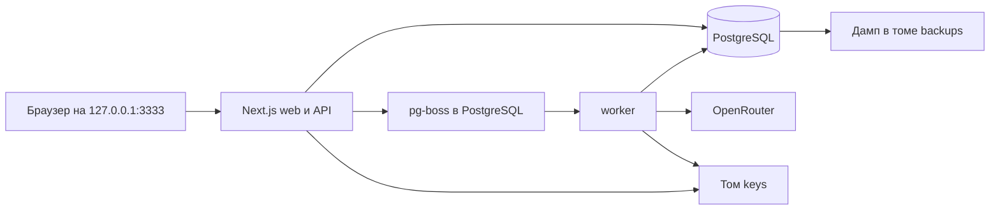

# Устройство приложения

Этот документ описывает реализованную систему на текущем коммите. Правила работы для пользователя — в [руководстве](USER-GUIDE.md); HTTP-контракты — в [API](API.md); Docker и сохранность данных — в [операционном руководстве](OPERATIONS.md). [ТЗ 2.1](../TECHNICAL_SPEC.md) остается источником требований, но исторические планы в нем не следует принимать за выполненный код.

## Компоненты

В Docker Compose работают `db`, `web`, `worker`, одноразовые `backup` и `migrate`. Отдельных Redis, векторной БД и внешнего хранилища текстов нет. Все проекты, исходники, результаты, версии, задания и учет токенов находятся в PostgreSQL. Клиентский React хранит только текущее состояние формы; он не является хранилищем профиля.

| Область | Основные файлы | Ответственность |
| --- | --- | --- |
| Главная, настройки, проект | `src/app/page.tsx`, `src/app/settings/page.tsx`, `src/app/projects/[id]/page.tsx` | Интерфейс, редакторы и навигация |
| Доска метода 2 | `src/components/method-board.tsx`, `src/components/rules-board.tsx` | Выбор приемов и редактирование правил |
| HTTP API | `src/app/api/v1/[[...path]]/route.ts`, `src/lib/http.ts` | Проверка входов, владельца, ревизий, операций |
| Доменные схемы | `src/lib/domain.ts`, `src/lib/method.ts`, `src/lib/rules-service.ts` | Форматы анализа, правила, основания и снимки |
| OpenRouter и тестовый адаптер | `src/lib/provider.ts`, `src/lib/test-adapter.ts` | Запросы к модели и проверка ответов |
| Очередь и worker | `src/lib/queue.ts`, `src/worker.ts` | Фоновые задания, повторы, отмена, учет usage |
| БД и секрет | `prisma/schema.prisma`, `src/lib/db.ts`, `src/lib/secret.ts` | Данные, внутренний владелец, шифрование ключа |
| Контейнеры и миграции | `compose.yaml`, `Dockerfile`, `prisma/migrations/`, `scripts/` | Сборка, запуск, дамп и миграции |

Версии зависимостей закреплены в `package-lock.json`. Основной стек: Next.js 16, React 19, TypeScript, PostgreSQL 17, Prisma 7, Zod 4, pg-boss 12. Цветовые темы и локальные шрифты находятся в `src/app/style.css` и `public/fonts`.

## Почему процесс разбит на шаги

| Решение | Причина |
| --- | --- |
| Независимый анализ каждого референса | Прием и его подтверждение остаются связанными с конкретным текстом; модель не смешивает нескольких авторов в одном разборе. |
| Отдельные роли «Мой голос» и «Ориентир» | Свое звучание можно сохранять как основу, а чужие приемы выбирать по одному, не копируя всю манеру источника. |
| Отдельный шаг правил в методе 2 | Отмеченная карточка анализа еще не является готовой инструкцией. Пользователь видит, редактирует и утверждает конкретные правила до сборки. |
| Снимок модели и рабочих инструкций внутри цикла | Повторные операции используют те же настройки; смена модели не переосмысляет незаметно уже начатую работу. |
| Предложения документов перед применением | Новая генерация не затирает вручную отредактированный текст; пользователь сравнивает варианты и решает, какой применить. |
| Отдельный worker и PostgreSQL-очередь | Длительный запрос к модели не удерживает браузерный HTTP-запрос, а состояние задания остается доступным после обновления страницы. |
| Раздельные тома БД и master key | Пересборка контейнера сохраняет данные и возможность расшифровать сохраненный ключ OpenRouter. |

## Данные и жизненный цикл

В локальном режиме приложение использует одного внутреннего владельца с фиксированным ID. Публичной регистрации и многопользовательского входа нет. Доступ к сущностям в API проверяется через принадлежность проекту этого владельца.

Основная цепочка данных:

1. `Project` объединяет несколько `Cycle`. Новый проект создает цикл метода 2 и пять пустых `Reference`.
2. `ReferenceText` хранит редакции исходника; `Reference.currentTextRevisionId` указывает рабочую редакцию. `Analysis` привязан к конкретной редакции текста. При изменении текста старый анализ остается в истории, но выбор для нового шага требует актуального анализа.
3. `Selection` хранит состояние конкретного элемента анализа, его роль, выраженность, частоту и условие. Для метода 2 `ruleInput` берет только выбранные элементы из актуальных разборов неархивных источников, плюс пожелания и ограничения цикла.
4. `RuleBatch` хранит снимок оснований и первоначальных кандидатов модели. `VoiceRule` хранит текущее редактируемое правило; `RuleRevision` — его сохраненные редакции. При новой генерации создается еще одна группа и новые неотмеченные правила.
5. `Proposal` хранит предложенный текст полной инструкции или промпта. Рабочие поля `Cycle.fullText` и `Cycle.promptText` меняются при явном применении предложения либо при ручной правке.
6. `VoiceVersion` хранит неизменяемый JSON-снимок состояния. **Продолжить с версии** создает новые рабочие записи и переносит данные снимка, не меняя оригинал.

`Cycle.methodVersion=1` означает прежнюю прямую сборку из выбранных карточек, пожеланий и ограничений. Новые проекты и обычные новые циклы получают `methodVersion=2`: между выбором приемов и полной инструкцией есть отдельный шаг правил. Сохраненная версия продолжает метод своего исходного цикла.

Для новых циклов с DeepSeek Flash интерфейс и API предлагают `reasoningEffort=low`; рассуждение остается включенным, явный выбор пользователя сохраняется. Отдельный режим `none` отправляется как `reasoning.enabled=false`, если пользователь его выбрал. Зафиксированный цикл не меняет это значение задним числом. Анализ дополнительно передает мягкое предпочтение `provider.preferred_min_throughput.p90=100`, чтобы OpenRouter по возможности выбирал более быстрый endpoint той же модели; это не гарантирует конкретную скорость и может изменить фактического провайдера и цену. В успешных новых заданиях `AiJob.result.diagnostics` хранит времена подготовки, сериализации, ожидания заголовков, получения потока, проверки и записи, размер HTTP-запроса и доступные сведения о reasoning tokens. При ошибке сохраняются достигнутые этапы и время до отказа, без исходного текста и ключа.

## Что именно отправляется модели

| Операция | Вход модели | Откуда берется |
| --- | --- | --- |
| Анализ | Один текущий текст референса, глубина и служебные ID/версия метода | Снимок задания при запуске анализа |
| Кандидаты правил, метод 2 | Выбранные принципы, эффекты и нюансы с ролью источника и настройками, пожелания, ограничения | Отдельные поля исходного текста, цитат, автора и названия не включаются |
| Полная инструкция, метод 2 | Только отмеченные неархивные правила: текст, направление, категория, условие и сила | Без неотмеченных кандидатов и исходных пожеланий отдельным полем |
| Полная инструкция, метод 1 | Выбранные элементы, пожелания и ограничения | Прежний контракт цикла |
| Промпт | Точный текущий текст полной инструкции | Из редактора документа |
| Проверка или проба | Точный текст выбранного документа; для пробы также ситуация | Из редактора документа |

Одна модель и снимок комплекта рабочих инструкций хранятся в `Cycle`. Настройки нового цикла можно менять до фиксации. Анализ, формирование правил или полная сборка методом 2 фиксируют цикл; последующие задания читают модель, уровень рассуждения и инструкции из него. Операции над вручную заполненным документом до этих действий сами по себе не фиксируют цикл. Переход на другую модель или редакцию инструкций после фиксации создает отдельный цикл. Скрытого переключения модели нет.

Приложение оценивает размер входа как длину JSON примерно по три символа на токен с резервом 2500. Если у цикла известен `modelContext`, превышение останавливает запрос до очереди. Это приближенная защитная проверка, а не точный токенизатор выбранной модели; при неизвестном пределе приложение не умеет гарантировать достаточный контекст. Исходник не укорачивается автоматически.

## Очередь и ответы провайдера

API сохраняет `AiJob` и ставит его в очередь pg-boss внутри PostgreSQL. Worker обрабатывает не более двух заданий одновременно. Состояния задания: `queued`, `running`, `cancel_requested`, `canceled`, `succeeded`, `failed`. Дополнительный `stage` уточняет реальный этап: соединение, ожидание, рассуждение, получение потока, проверка, сохранение, исправление формата или повтор. Интерфейс обновляет эти данные опросом API; отображаемое время считается по сохраненным меткам времени. Процент готовности не рассчитывается.

OpenRouter вызывается через `/api/v1/chat/completions` с выбранным model ID. Анализ и кандидаты правил принимают потоковый ответ по строгой JSON-схеме. Остальные операции требуют JSON-объект. Ответы валидируются схемами Zod; цитаты в разборе сверяются с исходным текстом. Неподтвержденные цитаты помечаются. Провайдер не получает инструментов для файловой системы, SQL или произвольных сетевых действий. Запасная модель не используется.

На временные ошибки 429/5xx предусмотрено до двух повторов; один неверный JSON может получить попытку исправления формата. Таймаут одного запроса зависит от операции: правила — 6 минут, анализ — 3 минуты в кратком режиме, 12 минут в подробном, 14 минут в углубленном, прочие операции — 3 минуты. Повтор может повлечь отдельный расход у провайдера. `Usage` хранит данные по каждой попытке с уникальностью `(jobId, attempt)`; если провайдер не вернул токены, итог помечается неполным.

Перед публикацией результата worker повторно проверяет состояние задания и то, что проект и цикл существуют и не архивированы. Поздний ответ отмененного задания не применяется. Анализ, пришедший после правки текста, остается привязанным к старой редакции и не становится разбором новой. Worker при запуске повторно ставит прерванные `running` задания в очередь.

## Защита и сохранность

- Compose по умолчанию публикует только веб-порт на `127.0.0.1`; сервер отвергает неподходящий `Host`, а для изменений требует совпадающий `Origin` и JSON. Это локальная защита, а не схема публичной авторизации.
- Ключ OpenRouter шифруется AES-256-GCM. Зашифрованная запись и ее маска находятся в БД, master key — в отдельном томе `keys`. API не возвращает полный ключ клиенту.
- API ограничивает размер входа, валидирует поля, владельца и ревизию. Для платных заданий, версии и применения предложения требуется `Idempotency-Key`: повтор того же запроса возвращает прежний ответ, другой запрос с тем же ключом получает конфликт.
- Перед миграцией существующей БД Compose создает дамп в томе `backups`. Скрипт проверки восстанавливает последний дамп во временную БД; автоматического восстановления поверх рабочей БД нет.
- Текст модели хранится и отображается как текст в React. Приемы, правила и документы остаются редактируемыми; проверка конфликтов не блокирует сохранение или экспорт.

## Известные границы текущей реализации

Колонка правила (`do`/`dont`) и его свободная формулировка передаются сборке одновременно. `ruleWarnings` сейчас замечает только повтор выбранной формулировки или одинаковый текст в противоположных колонках после простого приведения регистра и знаков. Он не распознает фразы вроде «Чередуй…» в колонке «Не делай так» и не устраняет двойные отрицания. До доработки этой логики проверяйте направление и итоговый текст вручную; подробнее — в [руководстве](USER-GUIDE.md#как-формулировать-правила).

Переменная `{{selected_count}}` в рабочем шаблоне сборки пока вычисляется для старого поля `selected`. Сборка метода 2 передает поле `rules`, поэтому шаблон получит `0` при любом числе отмеченных правил. Сами правила в запросе присутствуют; ограничение касается только числовой подстановки в пользовательском шаблоне.

Тестовый адаптер дает детерминированные ответы для автоматических сценариев и явно обозначается в интерфейсе. Он не оценивает литературное качество реальной модели. Исторические и целевые результаты проверок записаны в [отчетах](AC-REPORT.md) и [приемке метода 2](METHOD-ACCEPTANCE.md).
